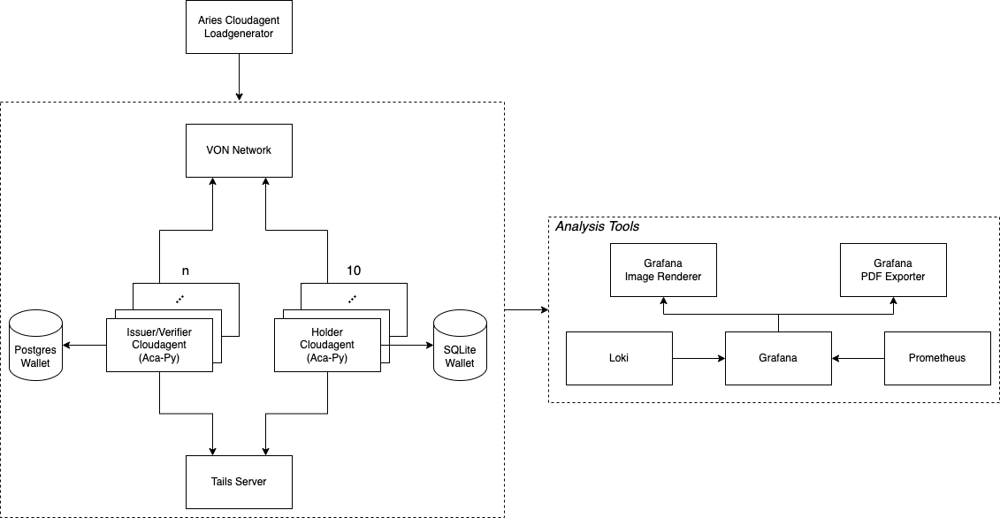

# Aries Cloud Agent Load Generator

A simple load generator to test the performance of the ACA-PY agent.

## System Overview

This repository comes with an automated testing setup consisting of:

- n Issuer/Verifier [ACA-Py](https://github.com/hyperledger/aries-cloudagent-python) instance(s) depending on
  the [configuration](#configuration) (+ 1 shared Postgres Wallet DB)
- nginx as reverse proxy for the Issuer/Verifier instances
- n Holder [ACA-Py](https://github.com/hyperledger/aries-cloudagent-python) instance(s) (+ SQLite Wallet DB for each
  one)
- [Tails Server](https://github.com/bcgov/indy-tails-server/) to support revocation
- [VON-Network](https://github.com/bcgov/von-network) for a local deployment of an indy ledger
- Analysis Tools ([see below](#analysis-tools))
- Aries Clouadagent Load Generator itself



## Getting Started

### Prerequisites

You need to have [Docker](https://docs.docker.com/get-docker/)
and [Docker-Compose](https://docs.docker.com/compose/install/) installed.

Further, you need to ensure to not use [Docker Compose V2](https://docs.docker.com/compose/cli-command/) as it is
incompatible to the setup used by the load generator. To deactivate Compose V2 run `docker-compose disable-v2`.

### Configuration

To configure the environment create a `./setup/.env` file similar to [./setup/.env.example](./setup/.env.example)

Declarative deployment approach is used. All variables in the `./setup/.env` which have prefix `SYSTEM_` indicate what
and how components must be deployed.

- `SYSTEM_LEDGER=true` - ledger will be deployed
- `SYSTEM_ISSUER_POSTGRES_DB=true` - Postgres database wallet will be deployed
- `SYSTEM_ISSUER_POSTGRES_DB_CLUSTER=true` - Postgres database will be deployed as cluster
- `SYSTEM_METRICS_DASHBOARD=true` - Dashboard to collect system metrics will be deployed
- `SYSTEM_AGENTS=true` - Issuers and Holders will be deployed
- `SYSTEM_LOAD_GENERATOR=true` - Load generator which immediately generates load is deployed

### Management Script

To start the environment and execute the load generator run:

```
./setup/manage.sh start
```

This will start all necessary components as well as registering a DID from the given seed in the `.env` file. The Load Generator itself is also included as a Docker container using this command.

To restart the environment, run:

```
./setup/manage.sh restart
```

If stop the system, delete all data, and remove all containers, run:

```
./setup/manage.sh down
```

## Analyze the Test Results

This project includes a setup for analyzing and visualizing the test results. The whole analysis setup is started
automatically when starting the test environment and available under http://localhost:3000/d/0Pe9llbnz/test-results.

### Analysis Tools

- **Grafana:** is used to visualize the collected data on a dashboard
- **Grafane Image Renderer:** used to render Grafana graphs as images to export them to a PDF (uses
  the [Image Renderer Plugin](https://grafana.com/grafana/plugins/grafana-image-renderer/))
- **Grafana PDF Exporter:** used to export a Grafana dashboard as a PDF (
  uses [IzakMarais/reporter](https://github.com/IzakMarais/reporter))
- **Grafana Loki:** is used to collect logs from services like the Load Generator
- **Prometheus:** is used to collect metrics from services like cAdvisor, node-exporter

### Install node-exporter for collecting host metrics
Prometheus *Node Exporter* exposes a wide variety of hardware- and kernel-related metrics.
Follow the installation guide to install `node-exporter` as a native application: [Prometheus Node Exporter](https://prometheus.io/docs/guides/node-exporter/)

You may consider running `node-exporter` on system startup, by adding it to `sudo crontab -e`
```
@reboot [INSTALLATION-DIR]/node_exporter > /dev/null 2>&1
```

### View Test Results in Grafana

Grafana runs on http://localhost:3000. It comes preconfigured with dashboards to visualize the test results from the
load tests. You can for example open http://localhost:3000/d/0Pe9llbnz/test-results to the test results.

To see any data on the dashboard, ensure to select the right time range in Grafana for which data has been collected.

### Export Grafana Dashboard as PDF

Using [IzakMarais/reporter](https://github.com/IzakMarais/reporter) it is possible to export a dashboard as a PDF. For
this a link exists in the top right corner of the dashboards. The PDF generation can take multiple minutes depending on
the Dashboard complexity. Check the logs of the `grafana-pdf-exporter` container in case you want to see the progress of
the PDF generation.

## Debug AcaPy

In case you want to debug the AcaPy while running the load-tests you can
set `ISSUER_VERIFIER_AGENT_ENABLE_DEBUGGING=true` in the `.env`. Afterwards, you can start the test environment
using `./setup/manage.sh debug`. This will build an AcaPy docker image based on the AcaPy version currently checked out
under `./setup/agents/acapy` and includes a Python debugger into the docker image.

Once the test environment started the issuer-verifier-acapy will state `=== Waiting for debugger to attach ===`. To
attach a debugger open `./setup/agents/acapy` in VS Code, add the following debug configuration to the `launch.json`,
and start the debugging.

```
{
  "version": "0.2.0",
  "configurations": [
    
    {
      "name": "Python: Remote Attach",
      "type": "python",
      "request": "attach",
      "connect": {
        "host": "localhost",
        "port": 5678
      },
      "pathMappings": [
        {
          "localRoot": "${workspaceFolder}",
          "remoteRoot": "."
        }
      ]
    }
  ]
}
```

Finally, you can start the load-generator from the IDE or by running `./mvnw spring-boot:run`.

## Troubleshooting

### Issues during system start up

The startup process is orchestrated by the [manage.sh](./setup/manage.sh). During this process `sleep XX`
is used to wait for Docker containers to properly start before continuing with the setup. Depending on the system's
performance the sleep durations might need to be increased to ensure that the containers get enough time to boot.

#### DID is not Published to Ledger

In case the VON network is not up and running before the [manage.sh](./setup/manage.sh) script tries to publish the DID
on the ledger, the DID will not be published. Consequently, the issuer-verifier-acapy will fail to start and throws a
error message similar to
`Ledger rejected transaction request: client request invalid: could not authenticate, verkey for VfHmVDbSvAdnM7Ph2PFh2a cannot be found`
.

Increase the sleep time between starting the ledger and registering the DID to avoid this issue.

### Only started iterations are visible on the "Test Results" Grafana Dashboard

This is likely caused by a communication issue between the AcaPy and the Load Generator. The AcaPy should notify the
Load Generator about updates via the Webhook Endpoint. If the Load Generator does not receive the updates or is unable
to process the updates it will not log any progress on the "Test Results" dashboard in Grafana.

Alternatively, it can also indicate that the load generator is not able to reach out to the issuer-verifier and/or
holder agents' admin API. Ensure that issuer-verifier as well as holder agent containers are running and that the
load-generator is using the correct URLs to reach out to the admin APIs.

Further, the holder agents need to be able to reach the issuer-verifier DIDcomm endpoint to accept connection
invitations.
